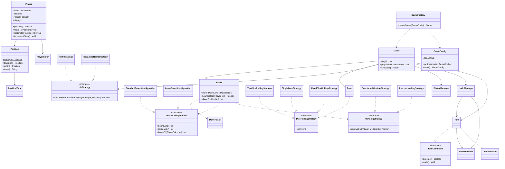

# Simple Frustration

> 一个基于「Frustration / Ludo 式圆形棋盘」的控制台桌游模拟器——以**面向对象**与**多种 GoF 设计模式**实现，支持四种规则变体、四名玩家、命令行运行、胜率统计与撤销功能。

---

## 1. 项目结构

项目由根目录的**基础版**（单 `main` 方法探索版）与 `frustration/` 包下的**面向对象重构版**两部分组成。重构版按职责拆分为 7 个子包，共 **38 个 `.java` 文件**。

```
计算机设计与架构/
├── SimpleFrustration.java          # 第一阶段基础版（单 main，对照用）
│
└── frustration/
    ├── Main.java                   # 命令行主运行器（入口）
    │
    ├── model/                      # 领域模型（无外部依赖）
    │   ├── Player.java             # 玩家
    │   ├── Position.java           # 位置值对象（不可变）
    │   ├── PositionType.java       # 位置类型枚举
    │   ├── PlayerColor.java        # 玩家颜色枚举
    │   └── MoveResult.java         # 单次移动结果
    │
    ├── board/                      # 棋盘与布局策略
    │   ├── Board.java              # 棋盘几何（移动/分叉/折返）
    │   ├── BoardType.java          # 棋盘类型枚举
    │   ├── BoardConfiguration.java # 布局策略接口
    │   ├── StandardBoardConfiguration.java
    │   └── LargeBoardConfiguration.java
    │
    ├── dice/                       # 骰子策略
    │   ├── Dice.java               # 骰子上下文
    │   ├── DiceRollingStrategy.java # 掷骰策略接口
    │   ├── TwoDiceRollingStrategy.java
    │   ├── SingleDiceStrategy.java
    │   └── FixedDiceRollingStrategy.java
    │
    ├── rule/                       # 游戏规则策略
    │   ├── HitStrategy.java        # 碰撞策略接口
    │   ├── NoHitStrategy.java
    │   ├── HitBackToHomeStrategy.java
    │   ├── WinningStrategy.java    # 获胜判定策略接口
    │   ├── OvershootWinningStrategy.java
    │   └── PreciseLandingStrategy.java
    │
    ├── game/                       # 引擎 + 配置 + 工厂 + 命令/备忘录
    │   ├── Game.java               # 游戏引擎（回合循环/胜负/撤销）
    │   ├── GameConfig.java         # 单例配置
    │   ├── GameFactory.java        # 简单工厂
    │   ├── PlayerManager.java      # 玩家列表与回合轮转
    │   ├── Turn.java               # 命令：单个回合
    │   ├── TurnCommand.java        # 命令接口
    │   ├── TurnMemento.java        # 备忘录：回合前快照
    │   ├── UndoManager.java        # 撤销管理器
    │   └── UndoDecision.java       # 撤销决策钩子
    │
    └── demo/                       # 验证/证据类
        ├── Demos.java              # 一次性跑 5 个 Brief 示例
        ├── PreciseLandingDemo.java
        ├── HitBackToHomeDemo.java
        ├── SingleDiceDemo.java
        ├── LargeBoardDemo.java
        ├── FourPlayersDemo.java
        └── UndoDemo.java
```

---

## 2. 类设计及职责

| 类/接口 | 职责 | 所属包 |
|---------|------|--------|
| `SimpleFrustration` | 第一阶段单 `main` 方法基础版，作为重构前的探索对照 | 根目录 |
| `Main` | 命令行入口：解析参数 → 配置单例 → 调工厂运行/统计胜率 | frustration |
| `Player` | 玩家：颜色、名称、Home、当前位置、回合数；位置封装（只能通过 `moveTo`/`restoreTo` 修改） | model |
| `Position` | **不可变值对象**，表示棋盘上一个位置（HOME/BOARD/TAIL/END 四态），可安全对外共享 | model |
| `PositionType` | 位置类型枚举（HOME/BOARD/TAIL/END） | model |
| `PlayerColor` | 玩家颜色枚举（Red/Blue/Green/Yellow），集中映射颜色 → 显示名 | model |
| `MoveResult` | 一次移动的结果：落点 + 是否越过 END | model |
| `Board` | 棋盘几何：圆形主盘 ↔ 私有尾部映射、分叉点、前进/折返移动（纯函数，不产生副作用） | board |
| `BoardConfiguration` | 棋盘布局策略接口：主盘格数、尾长、各玩家 Home | board |
| `StandardBoardConfiguration` | 标准棋盘：18 格 / 3 尾（含 END） | board |
| `LargeBoardConfiguration` | 大棋盘：36 格 / 6 尾（含 END） | board |
| `BoardType` | 棋盘类型枚举（STANDARD / LARGE） | board |
| `Dice` | 骰子上下文，委托给 `DiceRollingStrategy` | dice |
| `DiceRollingStrategy` | 掷骰策略接口（每回合一个点数） | dice |
| `TwoDiceRollingStrategy` | 双骰子（2~12） | dice |
| `SingleDiceStrategy` | 单骰子（1~6） | dice |
| `FixedDiceRollingStrategy` | 固定序列骰子（测试/复现 Brief 示例） | dice |
| `HitStrategy` | 碰撞策略接口 | rule |
| `NoHitStrategy` | 基础规则：忽略碰撞，多人可同格 | rule |
| `HitBackToHomeStrategy` | 变体 2：被撞者送回 Home | rule |
| `WinningStrategy` | 获胜判定策略接口 | rule |
| `OvershootWinningStrategy` | 基础规则：落到或越过 END 即胜 | rule |
| `PreciseLandingStrategy` | 变体 1：精确落点才胜，越过则折返 | rule |
| `Game` | 游戏引擎：回合循环、胜负判定、碰撞处理、撤销集成、输出 | game |
| `GameConfig` | **单例**，全局持有当前启用的变体组合 | game |
| `GameFactory` | **简单工厂**，根据配置动态选择策略并组装 `Game` | game |
| `PlayerManager` | 玩家有序列表、回合轮转（`current`/`advance`）、总回合数、定位被撞者 | game |
| `Turn` | **命令对象**：封装一个回合（`roll` 预览 → `commit` 落地），支持 `undo` | game |
| `TurnCommand` | 命令接口（`execute` / `undo`） | game |
| `TurnMemento` | **备忘录**：回合开始前的棋盘快照（所有玩家位置+回合数） | game |
| `UndoManager` | 撤销管理器（caretaker）：每玩家 3 次撤销额度 | game |
| `UndoDecision` | 撤销决策钩子（`@FunctionalInterface`） | game |
| `Demos` | 一次性复现 Brief 的 5 个 worked example | demo |
| `PreciseLandingDemo` / `HitBackToHomeDemo` / `SingleDiceDemo` / `LargeBoardDemo` | 各变体的独立验证演示 | demo |
| `FourPlayersDemo` | 四玩家模式的 Brief 示例复现 | demo |
| `UndoDemo` | 撤销功能的两个场景演示 | demo |

---

## 3. 设计模式使用说明

### 3.1 Strategy（策略模式）

**实现位置**：四个规则接口各自独立构成一个策略族，由 `GameFactory` 在运行时按配置注入。

| 策略接口 | 所在包 | 具体实现 |
|---------|--------|----------|
| `DiceRollingStrategy` | dice | `TwoDiceRollingStrategy` / `SingleDiceStrategy` / `FixedDiceRollingStrategy` |
| `HitStrategy` | rule | `NoHitStrategy` / `HitBackToHomeStrategy` |
| `WinningStrategy` | rule | `OvershootWinningStrategy` / `PreciseLandingStrategy` |
| `BoardConfiguration` | board | `StandardBoardConfiguration` / `LargeBoardConfiguration` |

**解决的问题**：游戏规则（掷骰方式、碰撞处理、获胜判定、棋盘大小）是**可变且正交**的，若用 `if/else` 堆在引擎里，每加一条规则都要改核心代码，违背「开闭原则」。

**为什么选它**：把每条规则抽象成接口 + 多态，引擎（`Game`）只依赖抽象，新增变体 = 新增一个实现类并注册到工厂，**无需改动 `Game`**。这直接满足了 Brief 对「variation 可自由组合」的要求。

### 3.2 Singleton（单例模式）

**实现位置**：`GameConfig`，私有构造 + `private static final INSTANCE` + `getInstance()`。

**解决的问题**：一次运行中「当前启用的变体组合」应当是**全局唯一**的一份；若存在多份配置，`GameFactory` 会读到不一致的状态。

**为什么选它**：配置是跨组件共享的全局状态，单例保证全局唯一、避免重复初始化，配合链式方法（`reset().useBoard(...).enableHit()...`）提供流畅的配置 API。

### 3.3 Simple Factory（简单工厂模式）

**实现位置**：`GameFactory.createGame(GameConfig)`。

**解决的问题**：组装一个 `Game` 需要根据配置正确选择 Board/Dice/HitStrategy/WinningStrategy 及玩家列表，这段「选择逻辑」若散落在调用方会重复且易错。

**为什么选它**：把「策略选择 + 组装」集中到一处，调用方只需一行 `GameFactory.createGame(config)`，把**创建**与**使用**解耦。

### 3.4 Command（命令模式）

**实现位置**：`TurnCommand`（接口）与 `Turn`（具体命令，`roll()` → `commit()` / `undo()`）。

**解决的问题**：撤销要求「把一次回合的完整动作封装成一个可回退的对象」。

**为什么选它**：把回合封装为命令对象后，`Game` 的主循环不再关心回合内部细节，只需「创建命令 → 执行/撤销」。为未来扩展（如重放、日志、命令队列）留出了统一接口。

### 3.5 Memento（备忘录模式）

**实现位置**：`TurnMemento`（快照）、`UndoManager`（caretaker，持有撤销额度）、`Turn`（originator，创建并还原快照）。

**解决的问题**：撤销必须能把棋盘**精确还原**到该回合开始前——包括被 HIT 撞回 Home 的**其他玩家**，因此快照要保存整桌状态，而不是当前玩家一人。

**为什么选它**：备忘录把「状态保存」封装在 `TurnMemento` 内部，`Game`/`UndoManager` 不需要了解玩家内部字段，遵守封装原则；同时 `UndoManager` 通过**每玩家 3 次额度**防止无限重试。

### 3.6 其他设计考量

- **封装**：`Player` 的 `position` 字段私有、`Position` 不可变，外部只能读不能随意改；修改位置只能通过 `moveTo`/`restoreTo`（仅引擎调用）。
- **不可变值对象**：`Position` 无 setter、`equals/hashCode` 基于类型+值，可安全跨层共享。
- **依赖倒置**：`Game` 只依赖 `Board`/`Dice`/`HitStrategy` 抽象，不依赖任何具体策略。
- **单一职责**：模型、棋盘、骰子、规则、引擎各司其职，`Game` 不再包含位置计算或玩家管理细节。

---

## 4. 变体实现说明

四种变体均以**策略类**实现，通过 `GameConfig`（单例）+ `GameFactory`（工厂）**任意组合**。

| 编号 | 变体 | 规则 | 实现方式 | 涉及类/策略 |
|------|------|------|----------|-------------|
| 1 | **精确落点（Precise Landing）** | 必须掷出**精确点数**到 END；超出则从 END 折返、沿尾部倒走、再逆时针绕主盘，直到步数用尽 | 新增 `WinningStrategy` 实现 + `Board.bounceBack()` 折返几何 | `PreciseLandingStrategy`、`Board.bounceBack()` |
| 2 | **碰撞送回 Home（HIT）** | 落在他人占据的格上，**被撞者**送回其 Home（Home 位置安全不可撞；尾部私有不会相撞） | 新增 `HitStrategy` 实现 + `Game`/`PlayerManager` 命中判定 | `HitBackToHomeStrategy`、`PlayerManager.findVictim()` |
| 3 | **单骰子模式（Single Die）** | 每回合只掷一个 6 面骰（1~6），与双骰（2~12）可切换 | 新增 `DiceRollingStrategy` 实现，工厂按 `diceCount` 二选一 | `SingleDiceStrategy` |
| 4 | **大棋盘（Large Board）** | 主盘 36 格、尾 6 格（含 END）、Home 更分散 | 新增 `BoardConfiguration` 实现，`Board` 全程按接口读尺寸（无硬编码） | `LargeBoardConfiguration` |

> 注：变体 4 中「6 个尾部位置」按 Brief 原文意为 **T1~T5 + END = 6 格**（END 即第 6 格），而非 T1~T6+END=7 格；实现输出与 Brief 示例逐行一致可印证。

### 4.1 高级功能

- **四名玩家模式**：`PlayerColor` 扩展 Green/Yellow；`BoardConfiguration.homeOf(colour, playerCount)` 按人数动态分配 Home（标准盘 Red=1/Blue=5/Green=10/Yellow=14；大棋盘 Red=1/Blue=10/Green=19/Yellow=28）；`PlayerManager` 管理任意人数的有序轮转。
- **撤销（Undo）**：命令 + 备忘录模式，见第 3 节；每玩家每局最多 3 次。
- **胜率统计**：`Main --games N` 静默运行 N 局（`Game.simulate()`），按颜色统计胜率。
- **命令行运行器**：`Main` 通过参数控制任意变体组合。

---

## 5. 程序执行流程

**文字描述**：`Main.main` 解析命令行参数 → 取得单例 `GameConfig` 并链式配置变体 → 交给 `GameFactory.createGame(config)` 组装出 `Game` → 调用 `play()`/`playWith()`/`simulate()` → 主循环反复「`Turn.roll()` 预览 → （可选）`UndoManager.undo()` 撤销重掷 → `Turn.commit()` 落地+碰撞」→ 直至 `landing.isEnd()` 判定胜者 → 打印获胜玩家与总回合数。

```mermaid
flowchart TD
    A[Main.main 启动] --> B[Args.parse 解析命令行参数]
    B --> C{--help?}
    C -->|是| Z[打印用法并退出]
    C -->|否| D["GameConfig.getInstance()<br/>reset 后链式配置变体"]
    D --> E{--games N > 1?}
    E -->|是| F[循环 N 局 GameFactory.createGame(config).simulate]
    F --> G[统计各颜色胜率并打印]
    E -->|否| H{--rolls 指定固定序列?}
    H -->|是| I[config.useFixedDice(rolls)]
    H -->|否| J[使用随机骰子策略]
    I --> K[GameFactory.createGame(config)]
    J --> K
    K --> L[game.play / playWith]
    L --> M{winner == null?}
    M -->|是| N["new Turn(...) 并 turn.roll() 预览"]
    N --> O{UndoDecision 请求撤销 且 有额度?}
    O -->|是| P["UndoManager.undo() 还原快照<br/>玩家重新掷骰"]
    P --> M
    O -->|否| Q["turn.commit() 落地 + 碰撞处理"]
    Q --> R{landing 是 END?}
    R -->|是| S[winner = 当前玩家]
    R -->|否| T[players.advance 轮转下一玩家]
    T --> M
    S --> V[打印 winner wins in N moves + Total plays]
    M -->|否| V
    V --> W[结束]
```

### 核心类图



---

## 6. 如何运行

### 6.1 编译

在项目根目录执行（`javac` 默认按 GBK 读取源码，本项目源码均为纯 ASCII，可直接编译）：

```bash
javac frustration/*.java frustration/*/*.java
```

### 6.2 运行主运行器

```bash
java Main [选项]
```

| 选项 | 取值 | 说明 | 默认 |
|------|------|------|------|
| `--dice` | `two` / `single` | 骰子模式（双骰/单骰） | two |
| `--hit` | `on` / `off` | 碰撞送回 Home 开关 | off |
| `--precision` | `on` / `off` | 精确落点获胜开关 | off |
| `--board` | `standard` / `large` | 棋盘大小 | standard |
| `--players` | `2` / `4` | 玩家数量 | 2 |
| `--rolls` | `n,n,n,...` | 固定骰子序列（单局测试） | 随机 |
| `--games` | `N` | 跑 N 局随机模拟并输出胜率 | 1 |
| `--help` | — | 打印帮助 | — |

### 6.3 示例命令

```bash
# 无参数运行 → 打印帮助菜单（列出所有选项与示例命令）
java Main

# 复现 Brief 基础示例（固定骰子）
java Main --rolls 12,12,7,8

# 单骰子 + 碰撞 + 精确落点 + 大棋盘（四种变体任意组合）
java Main --dice single --hit on --precision on --board large

# 四名玩家
java Main --players 4

# 四名玩家 + 大棋盘 + 碰撞 + 精确落点（复现 Brief 四玩家示例）
java Main --board large --hit on --precision on --players 4 \
  --rolls 12,5,2,12,7,4,2,12,3,5,2,12,5,4,4,8,2,2,12,3

# 跑 1000 局随机模拟统计胜率
java Main --games 1000

# 帮助
java Main --help
```

### 6.4 演示类

```bash
java frustration.demo.Demos              # 一次跑 5 个 Brief 示例
java frustration.demo.PreciseLandingDemo # 精确落点折返演示
java frustration.demo.HitBackToHomeDemo  # 碰撞送回 Home 演示
java frustration.demo.SingleDiceDemo     # 单骰子演示
java frustration.demo.LargeBoardDemo     # 大棋盘 + 各变体兼容演示
java frustration.demo.FourPlayersDemo    # 四玩家示例
java frustration.demo.UndoDemo           # 撤销功能演示
```

---

## 7. 测试与模拟结果示例

### 7.1 基础游戏（可越过 END，忽略碰撞，双骰）

```text
Board positions=18 Tail positions=3 Players={Red, Blue}
Player can land on or beyond the END position to win
HITS are ignored, multiple players can occupy the same position
Dice: Sequence of dice rolls (12,12,7,8)
Red play 1 rolls 12
Red moves from HOME (Position 1) to Position 13
Blue play 1 rolls 12
Blue moves from HOME (Position 10) to Position 4
Red play 2 rolls 7
Red moves from Position 13 to TAIL (Tail Position 2)
Blue play 2 rolls 8
Blue moves from Position 4 to END
Blue wins in 2 moves!
Total plays 4
```

### 7.2 变体 2：碰撞送回 Home（HIT）

```text
Dice: Sequence of dice rolls (8,2,3,4,9)
Red play 1 rolls 8
Red moves from HOME (Position 1) to Position 9
Blue play 1 rolls 2
Blue moves from HOME (Position 10) to Position 12
Red play 2 rolls 3
Red moves from Position 9 to Position 12
Blue Position 12 hit!
Blue moves from Position 12 to HOME (Position 10)
Blue play 2 rolls 4
Blue moves from HOME (Position 10) to Position 14
Red play 3 rolls 9
Red moves from Position 12 to END
Red wins in 3 moves!
Total plays 5
```

### 7.3 变体 1：精确落点（越界折返）

```text
Dice: Sequence of dice rolls (12,12,7,11,3,3)
Red play 2 rolls 7
Red moves from Position 13 to TAIL (Tail Position 2)
Blue play 2 rolls 11
Blue overshoots!
Blue moves from Position 4 to Position 9
Red play 3 rolls 3
Red overshoots!
Red moves from TAIL (Tail Position 2) to TAIL (Tail Position 1)
Blue play 3 rolls 3
Blue moves from Position 9 to END
Blue wins in 3 moves!
Total plays 6
```

### 7.4 四名玩家（大棋盘 + 碰撞 + 精确落点）

```text
Board positions=36 Tail positions=6 Players={Red, Blue, Green, Yellow}
Player must land exactly on the END position to win
Player will be sent HOME when HIT
...
Red play 3 rolls 3
Red moves from Position 20 to Position 23
Green Position 23 hit!
Green moves from Position 23 to HOME (Position 19)
...
Blue play 4 rolls 4
Blue moves from Position 24 to Position 28
Red Position 28 hit!
Red moves from Position 28 to HOME (Position 1)
...
Yellow play 5 rolls 3
Yellow moves from TAIL (Tail Position 3) to END
Yellow wins in 5 moves!
Total plays 20
```

### 7.5 撤销功能（UndoDemo）

```text
Undo: enabled (up to 3 per player)
Red play 1 rolls 12
Red moves from HOME (Position 1) to Position 13
Red undoes! 2 undos remaining.
Red play 1 rolls 12                     ← 撤销后重新掷骰（仍是 play 1）
Red moves from HOME (Position 1) to Position 13
...
Red play 1 rolls 5
Red undoes! 0 undos remaining.
Red play 1 rolls 5
Red has no undos left; move committed.   ← 第 4 次被拒，强制落地
```

### 7.6 胜率统计（标准盘，1000 局随机）

```text
Simulated 1000 games
Red    won 729 games (72.90%)
Blue   won 271 games (27.10%)
```

> 红方（先手）胜率显著更高，符合先手优势预期；四玩家时呈现 Red > Blue > Green > Yellow 的梯度。

---

## 8. 不足之处与改进方向

1. **撤销决策未接入 CLI**：目前撤销通过 `Game.playWith(UndoDecision)` 注入策略驱动（`UndoDemo` 演示），`Main` 未暴露 `--undo` 交互式开关。原因是要保持游戏「全自动模拟」的一致体验；若需要，可增加一个读 `System.in` 的交互式 `UndoDecision` 实现，代价是打破非交互模式。

2. **输出通过 `System.out` 硬编码**：`Game`/`Turn` 直接用 `System.out.println` 打印，关注点未完全分离。可抽象一个 `Output`/`Logger` 接口，既便于测试捕获，也符合「单一职责」。

3. **随机性未注入种子**：`TwoDiceRollingStrategy`/`SingleDiceStrategy` 内部自建 `Random`（虽已提供可注入 `Random` 的构造器），但 `GameFactory` 未暴露设置种子的入口。为可复现的随机测试，可在 `GameConfig` 增加 `seed` 字段。

4. **`Player.moveTo`/`restoreTo` 为 public**：分包后 `Game` 与 `Player` 跨包，为维持引擎可修改位置而放宽为 public（原为包私有）。更强封装可将 `Player` 与 `Game` 归入同一包恢复包私有，或引入一个仅引擎可见的内部接口。

5. **未覆盖的边界与自动化测试**：目前依赖 `demo/*` 手动对照 Brief 示例，缺乏 JUnit 单测。可补 `Board.move`/`bounceBack` 的几何边界（分叉点、多圈绕行）、HIT 的 Home 安全规则、Undo 额度耗尽等用例。

6. **可扩展性展望**：命令模式已为「重放 / 日志 / 多步撤销栈」留好接口；策略模式可继续新增规则（如「两步骰子」「炸弹格」）而不改核心；若引入共享尾部或可绕圈方向等新棋盘拓扑，只需实现新的 `BoardConfiguration`/`WinningStrategy`。

---

*项目用于软件设计与架构课程（Software Design and Architecture，MMU Task 1），实现了基础游戏 + 四种变体 + 四玩家 + 撤销 + 命令行运行器 + 胜率统计，综合运用 Strategy / Singleton / Simple Factory / Command / Memento 五种设计模式。*
