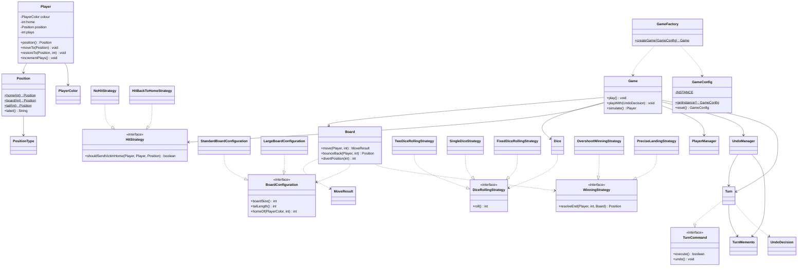

# Simple Frustration

> A console-based simulator of the "Frustration / Ludo-style" circular board game — built with object-oriented design and multiple GoF design patterns. It supports four rule variations, four players, a command-line runner, win-rate statistics, and an undo feature.

---

## 1. Project Structure

The project consists of a **base version** in the root directory (a single-`main` exploratory implementation) and the **object-oriented refactored version** under the `frustration/` package. The refactored version is organised into seven sub-packages, totalling **38 `.java` files**.

```
计算机设计与架构/
├── SimpleFrustration.java          # Phase-1 base version (single main, for comparison)
│
└── frustration/
    ├── Main.java                   # Command-line runner (entry point)
    │
    ├── model/                      # Domain model (no external dependencies)
    │   ├── Player.java             # A player
    │   ├── Position.java           # Immutable position value object
    │   ├── PositionType.java       # Position-type enum
    │   ├── PlayerColor.java        # Player-colour enum
    │   └── MoveResult.java         # Result of a single move
    │
    ├── board/                      # Board and layout strategies
    │   ├── Board.java              # Board geometry (movement / divert / bounce-back)
    │   ├── BoardType.java          # Board-type enum
    │   ├── BoardConfiguration.java # Layout strategy interface
    │   ├── StandardBoardConfiguration.java
    │   └── LargeBoardConfiguration.java
    │
    ├── dice/                       # Dice strategies
    │   ├── Dice.java               # Dice context
    │   ├── DiceRollingStrategy.java # Rolling strategy interface
    │   ├── TwoDiceRollingStrategy.java
    │   ├── SingleDiceStrategy.java
    │   └── FixedDiceRollingStrategy.java
    │
    ├── rule/                       # Game-rule strategies
    │   ├── HitStrategy.java        # Hit strategy interface
    │   ├── NoHitStrategy.java
    │   ├── HitBackToHomeStrategy.java
    │   ├── WinningStrategy.java    # Winning strategy interface
    │   ├── OvershootWinningStrategy.java
    │   └── PreciseLandingStrategy.java
    │
    ├── game/                       # Engine + config + factory + command/memento
    │   ├── Game.java               # Game engine (turn loop / win / undo)
    │   ├── GameConfig.java         # Singleton configuration
    │   ├── GameFactory.java        # Simple factory
    │   ├── PlayerManager.java      # Player list and turn rotation
    │   ├── Turn.java               # Command: a single turn
    │   ├── TurnCommand.java        # Command interface
    │   ├── TurnMemento.java        # Memento: pre-turn snapshot
    │   ├── UndoManager.java        # Undo caretaker
    │   └── UndoDecision.java       # Undo decision hook
    │
    └── demo/                       # Verification / evidence classes
        ├── Demos.java              # Runs all 5 brief worked examples
        ├── PreciseLandingDemo.java
        ├── HitBackToHomeDemo.java
        ├── SingleDiceDemo.java
        ├── LargeBoardDemo.java
        ├── FourPlayersDemo.java
        └── UndoDemo.java
```

---

## 2. Class Design & Responsibilities

| Class / Interface | Responsibility | Package |
|---------|------|--------|
| `SimpleFrustration` | Phase-1 single-`main` base version, kept as a before-refactoring reference | root |
| `Main` | CLI entry point: parse args → configure singleton → run/win-rate via factory | frustration |
| `Player` | A player: colour, name, home, current position, turn count; position is encapsulated (mutated only via `moveTo`/`restoreTo`) | model |
| `Position` | **Immutable value object** describing one square (HOME/BOARD/TAIL/END), safe to share | model |
| `PositionType` | Enum of the four location kinds (HOME/BOARD/TAIL/END) | model |
| `PlayerColor` | Player-colour enum (Red/Blue/Green/Yellow); centralises colour → display-name | model |
| `MoveResult` | Outcome of one move: landing square + whether it overshot END | model |
| `Board` | Board geometry: circular loop ↔ private-tail mapping, divert square, forward/backward movement (pure functions, no side effects) | board |
| `BoardConfiguration` | Layout strategy interface: main-loop size, tail length, each player's home | board |
| `StandardBoardConfiguration` | Standard board: 18 squares / 3 tail (incl. END) | board |
| `LargeBoardConfiguration` | Large board: 36 squares / 6 tail (incl. END) | board |
| `BoardType` | Board-type enum (STANDARD / LARGE) | board |
| `Dice` | Dice context, delegates to a `DiceRollingStrategy` | dice |
| `DiceRollingStrategy` | Rolling strategy interface (one total per turn) | dice |
| `TwoDiceRollingStrategy` | Two dice (2..12) | dice |
| `SingleDiceStrategy` | Single die (1..6) | dice |
| `FixedDiceRollingStrategy` | Fixed sequence of totals (for testing / reproducing the brief) | dice |
| `HitStrategy` | Hit strategy interface | rule |
| `NoHitStrategy` | Basic rule: hits ignored, players may share a square | rule |
| `HitBackToHomeStrategy` | Variation 2: the piece landed on is sent home | rule |
| `WinningStrategy` | Winning strategy interface | rule |
| `OvershootWinningStrategy` | Basic rule: landing on or beyond END wins | rule |
| `PreciseLandingStrategy` | Variation 1: exact landing wins, overshoot bounces back | rule |
| `Game` | Game engine: turn loop, win detection, hit resolution, undo integration, output | game |
| `GameConfig` | **Singleton** holding the active variation combination | game |
| `GameFactory` | **Simple factory** that assembles a `Game` from the configuration | game |
| `PlayerManager` | Ordered player list, turn rotation (`current`/`advance`), total plays, victim lookup | game |
| `Turn` | **Command object**: encapsulates one turn (`roll` preview → `commit` apply), supports `undo` | game |
| `TurnCommand` | Command interface (`execute` / `undo`) | game |
| `TurnMemento` | **Memento**: pre-turn board snapshot (all players' positions + turn counts) | game |
| `UndoManager` | Undo caretaker: per-player 3-undo credit | game |
| `UndoDecision` | Undo decision hook (`@FunctionalInterface`) | game |
| `Demos` | Reproduces all 5 brief worked examples in one run | demo |
| `PreciseLandingDemo` / `HitBackToHomeDemo` / `SingleDiceDemo` / `LargeBoardDemo` | Independent demonstrations of each variation | demo |
| `FourPlayersDemo` | Reproduces the brief's 4-player worked example | demo |
| `UndoDemo` | Demonstrates the undo feature in two scenarios | demo |

---

## 3. Design Patterns

### 3.1 Strategy

**Where**: four rule interfaces, each its own strategy family, injected at runtime by `GameFactory`.

| Strategy interface | Package | Implementations |
|---------|--------|----------|
| `DiceRollingStrategy` | dice | `TwoDiceRollingStrategy` / `SingleDiceStrategy` / `FixedDiceRollingStrategy` |
| `HitStrategy` | rule | `NoHitStrategy` / `HitBackToHomeStrategy` |
| `WinningStrategy` | rule | `OvershootWinningStrategy` / `PreciseLandingStrategy` |
| `BoardConfiguration` | board | `StandardBoardConfiguration` / `LargeBoardConfiguration` |

**Problem solved**: the rules (dice mode, hit handling, win condition, board size) are *variable* and *orthogonal*. Piling them into `if/else` inside the engine would violate the Open/Closed Principle — every new rule would force a change to core code.

**Why this pattern**: each rule becomes an interface + polymorphism; `Game` depends only on the abstractions. Adding a variation means adding one implementation and registering it in the factory, **without touching `Game`** — exactly what the brief asks for ("variations freely combinable").

### 3.2 Singleton

**Where**: `GameConfig` — private constructor + `private static final INSTANCE` + `getInstance()`.

**Problem solved**: the "currently active variation combination" must be globally unique for a single run; duplicate configs would let `GameFactory` read inconsistent state.

**Why this pattern**: the config is shared global state; the singleton guarantees a single instance and, together with the fluent methods (`reset().useBoard(...).enableHit()...`), gives a clean configuration API.

### 3.3 Simple Factory

**Where**: `GameFactory.createGame(GameConfig)`.

**Problem solved**: assembling a `Game` requires choosing Board/Dice/HitStrategy/WinningStrategy and the player list from the config; scattering this selection logic across call sites would be repetitive and error-prone.

**Why this pattern**: it centralises "strategy selection + assembly", so callers need only one line — `GameFactory.createGame(config)` — decoupling *creation* from *use*.

### 3.4 Command

**Where**: `TurnCommand` (interface) and `Turn` (concrete command, `roll()` → `commit()` / `undo()`).

**Problem solved**: undo requires wrapping a full turn's actions into one reversible object.

**Why this pattern**: once a turn is a command object, `Game`'s main loop no longer cares about turn internals — it just "creates a command → executes/undoes". It also opens a uniform interface for future replay, logging, or command queues.

### 3.5 Memento

**Where**: `TurnMemento` (snapshot), `UndoManager` (caretaker holding credits), `Turn` (originator creating and restoring the snapshot).

**Problem solved**: undo must restore the board *exactly* to the start of the turn — including **other players** sent home by a HIT, so the snapshot stores the whole table, not just the current player.

**Why this pattern**: the memento encapsulates state-saving inside `TurnMemento`, so `Game`/`UndoManager` never touch players' private fields (respecting encapsulation); `UndoManager` also caps each player at 3 undos to prevent infinite retries.

### 3.6 Additional Design Considerations

- **Encapsulation**: `Player.position` is private and `Position` is immutable; external code can read but not mutate, and mutation goes only through `moveTo`/`restoreTo` (engine-only).
- **Immutable value object**: `Position` has no setters; `equals`/`hashCode` are based on type + value, so it is safe to share across layers.
- **Dependency inversion**: `Game` depends only on the `Board`/`Dice`/`HitStrategy` abstractions, never on concrete strategies.
- **Single responsibility**: model, board, dice, rule and engine are separated; `Game` no longer contains position math or player-management details.

---

## 4. Variation Implementation

All four variations are strategy classes, combinable arbitrarily through `GameConfig` (singleton) + `GameFactory` (factory).

| # | Variation | Rule | Implementation | Classes involved |
|------|------|------|----------|-------------|
| 1 | **Precise Landing** | Must throw the **exact** number of steps to reach END; an overshoot bounces back from END, walks back down the tail, then continues anticlockwise until steps run out | New `WinningStrategy` implementation + `Board.bounceBack()` bounce-back geometry | `PreciseLandingStrategy`, `Board.bounceBack()` |
| 2 | **HIT (send home)** | Landing on an occupied square sends the **victim** home (Home squares are safe; tails are private so they never collide) | New `HitStrategy` implementation + hit detection in `Game`/`PlayerManager` | `HitBackToHomeStrategy`, `PlayerManager.findVictim()` |
| 3 | **Single Die** | Each turn rolls one 6-sided die (1..6), swappable with two dice (2..12) | New `DiceRollingStrategy` implementation, chosen by `diceCount` in the factory | `SingleDiceStrategy` |
| 4 | **Large Board** | Main loop of 36 squares, tail of 6 (incl. END), homes spread further apart | New `BoardConfiguration` implementation; `Board` reads sizes via the interface (no hard-coded 18/3) | `LargeBoardConfiguration` |

> Note: in variation 4, "6 tail positions" means **T1..T5 + END = 6** per the brief (END is the 6th), not T1..T6+END=7; the implementation's output matches the brief's example line-for-line, which confirms this interpretation.

### 4.1 Advanced Features

- **Four-player mode**: `PlayerColor` extended with Green/Yellow; `BoardConfiguration.homeOf(colour, playerCount)` assigns homes by player count (standard: Red=1/Blue=5/Green=10/Yellow=14; large: Red=1/Blue=10/Green=19/Yellow=28); `PlayerManager` handles rotation for any number of players.
- **Undo**: Command + Memento patterns (see Section 3); at most 3 undos per player per game.
- **Win-rate statistics**: `Main --games N` silently runs N games (`Game.simulate()`) and reports each colour's win rate.
- **Command-line runner**: `Main` controls any variation combination via flags.

---

## 5. Execution Flow

**Narrative**: `Main.main` parses CLI args → obtains the singleton `GameConfig` and configures it fluently → hands it to `GameFactory.createGame(config)` to assemble a `Game` → calls `play()`/`playWith()`/`simulate()` → the main loop repeatedly "`Turn.roll()` preview → (optional) `UndoManager.undo()` re-roll → `Turn.commit()` move + hit" → until `landing.isEnd()` sets a winner → prints the winning player and total plays.

```mermaid
flowchart TD
    A[Main.main starts] --> B[Args.parse parses CLI flags]
    B --> C{--help?}
    C -->|yes| Z[print usage and exit]
    C -->|no| D["GameConfig.getInstance()<br/>reset then fluently configure"]
    D --> E{--games N > 1?}
    E -->|yes| F[loop N games: GameFactory.createGame(config).simulate]
    F --> G[tally and print per-colour win rate]
    E -->|no| H{--rolls fixed sequence given?}
    H -->|yes| I[config.useFixedDice(rolls)]
    H -->|no| J[use random dice strategy]
    I --> K[GameFactory.createGame(config)]
    J --> K
    K --> L[game.play / playWith]
    L --> M{winner == null?}
    M -->|yes| N["new Turn(...) then turn.roll() preview"]
    N --> O{UndoDecision requests undo  and  credit left?}
    O -->|yes| P["UndoManager.undo() restores snapshot<br/>player re-rolls"]
    P --> M
    O -->|no| Q["turn.commit() applies move + hit"]
    Q --> R{landing is END?}
    R -->|yes| S[winner = current player]
    R -->|no| T[players.advance to next player]
    T --> M
    S --> V[print "winner wins in N moves" + "Total plays"]
    M -->|no| V
    V --> W[end]
```

### Core Class Diagram



---

## 6. How to Run

### 6.1 Compile

From the project root (`javac` reads sources in the platform default charset; all sources here are pure ASCII, so they compile directly):

```bash
javac frustration/*.java frustration/*/*.java
```

### 6.2 Run the Main Runner

```bash
java Main [options]
```

| Option | Value | Meaning | Default |
|------|------|------|------|
| `--dice` | `two` / `single` | Dice mode (two dice / single die) | two |
| `--hit` | `on` / `off` | Send-victim-home rule | off |
| `--precision` | `on` / `off` | Precise-landing rule | off |
| `--board` | `standard` / `large` | Board size | standard |
| `--players` | `2` / `4` | Number of players | 2 |
| `--rolls` | `n,n,n,...` | Fixed dice sequence (single run, testing) | random |
| `--games` | `N` | Run N random games and report win rate | 1 |
| `--help` | — | Print help | — |

### 6.3 Example Commands

```bash
# No options -> prints the help menu (all options and example commands)
java Main

# Reproduce the brief's basic example (fixed dice)
java Main --rolls 12,12,7,8

# Single die + HIT + precise landing + large board (any combination)
java Main --dice single --hit on --precision on --board large

# Four players
java Main --players 4

# Four players + large board + HIT + precise landing (brief's 4-player example)
java Main --board large --hit on --precision on --players 4 \
  --rolls 12,5,2,12,7,4,2,12,3,5,2,12,5,4,4,8,2,2,12,3

# Run 1000 random games and report win rate
java Main --games 1000

# Help
java Main --help
```

### 6.4 Demo Classes

```bash
java frustration.demo.Demos              # run all 5 brief examples
java frustration.demo.PreciseLandingDemo # precise-landing bounce-back
java frustration.demo.HitBackToHomeDemo  # hit-send-home
java frustration.demo.SingleDiceDemo     # single-die mode
java frustration.demo.LargeBoardDemo     # large board + compatibility
java frustration.demo.FourPlayersDemo    # four-player example
java frustration.demo.UndoDemo           # undo feature
```

---

## 7. Test & Simulation Output Examples

### 7.1 Basic game (overshoot allowed, no hits, two dice)

```text
Board positions=18 Tail positions=3 Players={Red, Blue}
Player can land on or beyond the END position to win
HITS are ignored, multiple players can occupy the same position
Dice: Sequence of dice rolls (12,12,7,8)
Red play 1 rolls 12
Red moves from HOME (Position 1) to Position 13
Blue play 1 rolls 12
Blue moves from HOME (Position 10) to Position 4
Red play 2 rolls 7
Red moves from Position 13 to TAIL (Tail Position 2)
Blue play 2 rolls 8
Blue moves from Position 4 to END
Blue wins in 2 moves!
Total plays 4
```

### 7.2 Variation 2: HIT (victim sent home)

```text
Dice: Sequence of dice rolls (8,2,3,4,9)
Red play 1 rolls 8
Red moves from HOME (Position 1) to Position 9
Blue play 1 rolls 2
Blue moves from HOME (Position 10) to Position 12
Red play 2 rolls 3
Red moves from Position 9 to Position 12
Blue Position 12 hit!
Blue moves from Position 12 to HOME (Position 10)
Blue play 2 rolls 4
Blue moves from HOME (Position 10) to Position 14
Red play 3 rolls 9
Red moves from Position 12 to END
Red wins in 3 moves!
Total plays 5
```

### 7.3 Variation 1: Precise Landing (overshoot bounces back)

```text
Dice: Sequence of dice rolls (12,12,7,11,3,3)
Red play 2 rolls 7
Red moves from Position 13 to TAIL (Tail Position 2)
Blue play 2 rolls 11
Blue overshoots!
Blue moves from Position 4 to Position 9
Red play 3 rolls 3
Red overshoots!
Red moves from TAIL (Tail Position 2) to TAIL (Tail Position 1)
Blue play 3 rolls 3
Blue moves from Position 9 to END
Blue wins in 3 moves!
Total plays 6
```

### 7.4 Four players (large board + HIT + precise landing)

```text
Board positions=36 Tail positions=6 Players={Red, Blue, Green, Yellow}
Player must land exactly on the END position to win
Player will be sent HOME when HIT
...
Red play 3 rolls 3
Red moves from Position 20 to Position 23
Green Position 23 hit!
Green moves from Position 23 to HOME (Position 19)
...
Blue play 4 rolls 4
Blue moves from Position 24 to Position 28
Red Position 28 hit!
Red moves from Position 28 to HOME (Position 1)
...
Yellow play 5 rolls 3
Yellow moves from TAIL (Tail Position 3) to END
Yellow wins in 5 moves!
Total plays 20
```

### 7.5 Undo feature (UndoDemo)

```text
Undo: enabled (up to 3 per player)
Red play 1 rolls 12
Red moves from HOME (Position 1) to Position 13
Red undoes! 2 undos remaining.
Red play 1 rolls 12                     ← undo then re-roll (still "play 1")
Red moves from HOME (Position 1) to Position 13
...
Red play 1 rolls 5
Red undoes! 0 undos remaining.
Red play 1 rolls 5
Red has no undos left; move committed.   ← 4th attempt refused, forced commit
```

### 7.6 Win-rate statistics (standard board, 1000 random games)

```text
Simulated 1000 games
Red    won 729 games (72.90%)
Blue   won 271 games (27.10%)
```

> Red (the first player) wins significantly more often, matching the expected first-mover advantage; with four players the win rate follows a Red > Blue > Green > Yellow gradient.

---

## 8. Limitations & Future Improvements

1. **Undo is not wired into the CLI**: undo is currently driven by injecting an `UndoDecision` strategy via `Game.playWith(...)` (see `UndoDemo`); `Main` does not expose an interactive `--undo` flag. This keeps the game a fully-automatic simulation. An interactive `UndoDecision` reading `System.in` could be added if needed, at the cost of breaking the non-interactive mode.

2. **Output is hard-coded to `System.out`**: `Game`/`Turn` print directly with `System.out.println`, so the output concern is not fully separated. Abstracting an `Output`/`Logger` interface would make output testable and honour the Single Responsibility Principle.

3. **Randomness is not seeded end-to-end**: `TwoDiceRollingStrategy`/`SingleDiceStrategy` build their own `Random` internally (injectable constructors exist), but `GameFactory` does not expose a seed. A `seed` field on `GameConfig` would enable reproducible random tests.

4. **`Player.moveTo`/`restoreTo` are public**: after splitting packages, `Game` and `Player` live in different packages, so position mutation was widened from package-private to public. Stronger encapsulation would put `Player` and `Game` in the same package (restoring package-private) or introduce an engine-only internal interface.

5. **No automated unit tests**: verification currently relies on `demo/*` manual comparison against the brief. JUnit tests could cover the geometry edge cases of `Board.move`/`bounceBack` (divert square, multi-lap wrap), the Home-safety rule of HIT, and undo-credit exhaustion.

6. **Extensibility outlook**: the Command pattern already provides a uniform interface for replay / logging / a multi-step undo stack; the Strategy pattern allows new rules (e.g. two-step dice, "bomb" squares) without touching the core; new board topologies (e.g. a shared tail) only require new `BoardConfiguration`/`WinningStrategy` implementations.

---

*Project for Software Design and Architecture (MMU Task 1). Implements the basic game + four variations + four-player mode + undo + a command-line runner + win-rate statistics, combining five design patterns: Strategy, Singleton, Simple Factory, Command, and Memento.*
